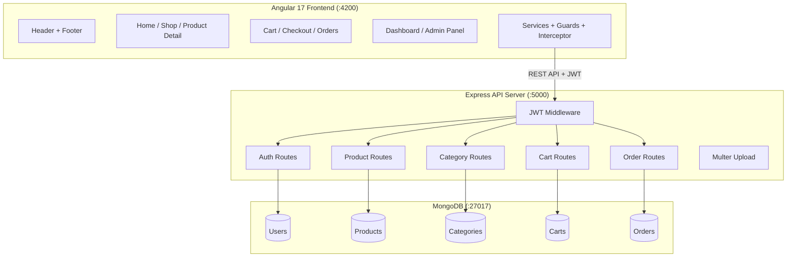

# 🛒 ShopSmart — Grocery E-Commerce Web Application

A professional, responsive full-stack grocery e-commerce platform with user storefront and admin panel.

**Tech Stack:** Angular 17 · Node.js · Express.js · MongoDB · JWT Authentication

---

## 📸 Features Overview

### 🛍️ Customer Storefront
| Feature | Description |
|---------|-------------|
| **Home Page** | Banner slider, category grid, featured products, best sellers |
| **Product Listing** | Filter by category/price/stock, sort, search, pagination |
| **Product Detail** | Image, pricing with discount, stock status, quantity selector |
| **Shopping Cart** | Add/remove items, quantity update, free delivery over ₹500 |
| **Checkout** | 3-step flow: Address → Payment → Confirm |
| **Order Tracking** | Visual progress bar (Ordered → Packed → Shipped → Delivered) |
| **User Dashboard** | Profile management, order history, saved addresses, password change |

### 🧑‍💼 Admin Panel
| Feature | Description |
|---------|-------------|
| **Dashboard** | 6 stat cards, sales chart, top products |
| **Product Management** | Full CRUD with search, stock tracking, image upload |
| **Category Management** | Add/rename/delete categories |
| **Order Management** | Status updates (Pending → Packed → Shipped → Delivered), detail view |
| **Customer Management** | View, block/unblock, delete customers |
| **Reports & Analytics** | Revenue stats, daily trends, top-selling products |
| **Settings** | Shop name, delivery charges, contact info |

---

## 🗂️ Project Structure

```
grocery-webapp/
├── backend/                    # Node.js + Express API Server
│   ├── config/
│   │   └── db.js               # MongoDB connection
│   ├── middleware/
│   │   ├── auth.js             # JWT auth + admin guard
│   │   ├── upload.js           # Multer file upload
│   │   └── errorHandler.js     # Global error handler
│   ├── models/
│   │   ├── User.js             # User with addresses + password hashing
│   │   ├── Product.js          # Product with category ref & text search
│   │   ├── Category.js         # Product categories
│   │   ├── Cart.js             # Per-user shopping cart
│   │   └── Order.js            # Orders with status tracking
│   ├── routes/
│   │   ├── auth.js             # Auth + user + admin customer routes
│   │   ├── products.js         # Product CRUD + search/filter
│   │   ├── categories.js       # Category CRUD
│   │   ├── cart.js             # Cart operations
│   │   └── orders.js           # Order + admin reports
│   ├── seed/
│   │   └── seeder.js           # Sample data seeder
│   ├── uploads/                # Product images (auto-created)
│   ├── .env                    # Environment variables
│   ├── package.json
│   └── server.js               # Express entry point
│
└── frontend/                   # Angular 17 SPA
    └── src/
        └── app/
            ├── admin/
            │   └── admin.component.ts      # Full admin panel
            ├── components/
            │   ├── header/header.component.ts
            │   └── footer/footer.component.ts
            ├── guards/
            │   └── auth.guard.ts           # authGuard + adminGuard
            ├── interceptors/
            │   └── auth.interceptor.ts     # JWT auto-attach
            ├── models/
            │   └── interfaces.ts           # TypeScript interfaces
            ├── pages/
            │   ├── home/                   # Landing page
            │   ├── login/                  # Login + Register
            │   ├── shop/                   # Product listing + filters
            │   ├── product-detail/         # Single product
            │   ├── cart/                   # Shopping cart
            │   ├── checkout/              # 3-step checkout
            │   ├── order-success/         # Order confirmation
            │   └── dashboard/             # User account
            └── services/
                ├── auth.service.ts
                ├── product.service.ts
                ├── category.service.ts
                ├── cart.service.ts
                └── order.service.ts
```

---

## 🚀 Getting Started

### Prerequisites

- **Node.js** 18+ — [Download](https://nodejs.org/)
- **MongoDB** — Running locally on port 27017, or [MongoDB Atlas](https://www.mongodb.com/atlas)
- **Angular CLI** — Installed globally or used via `npx`

### 1. Clone the Repository

```bash
git clone <repository-url>
cd grocery-webapp
```

### 2. Setup Backend

```bash
cd backend
npm install
```

Create a `.env` file (already included with defaults):

```env
PORT=5000
MONGO_URI=mongodb://localhost:27017/shopsmart
JWT_SECRET=shopsmart_jwt_secret_key_2024
```

### 3. Seed Sample Data

```bash
node seed/seeder.js
```

This creates:
- **Admin user** — `admin@shopsmart.com` / `admin123`
- **Sample users** — `ravi@example.com` / `password123`, `sita@example.com` / `password123`
- **8 categories** — Fruits, Vegetables, Dairy, Snacks, Drinks, Bakery, Meat, Household
- **32 products** — With prices, discounts, stock levels
- **Sample orders** — Various statuses for admin panel testing

### 4. Start Backend Server

```bash
node server.js
```

> ✅ API running at **http://localhost:5000**

### 5. Setup & Start Frontend

```bash
cd ../frontend
npm install
npx ng serve
```

> ✅ App running at **http://localhost:4200**

---

## 🔑 Login Credentials

| Role | Email | Password |
|------|-------|----------|
| **Admin** | admin@shopsmart.com | admin123 |
| **User** | ravi@example.com | password123 |
| **User** | sita@example.com | password123 |

### URLs
- **Storefront:** http://localhost:4200
- **Admin Panel:** http://localhost:4200/admin *(login as admin first)*
- **API Base:** http://localhost:5000/api
- **Health Check:** http://localhost:5000/api/health

---

## 📡 API Documentation

All API endpoints are prefixed with `/api`. Protected routes require a `Bearer <token>` header.

### Authentication (`/api/auth`)

| Method | Endpoint | Auth | Description |
|--------|----------|------|-------------|
| `POST` | `/register` | ❌ | Register new user |
| `POST` | `/login` | ❌ | Login, returns JWT token |
| `GET` | `/profile` | 🔒 | Get current user profile |
| `PUT` | `/profile` | 🔒 | Update name, phone, email |
| `PUT` | `/change-password` | 🔒 | Change password |
| `POST` | `/address` | 🔒 | Add delivery address |
| `DELETE` | `/address/:id` | 🔒 | Remove delivery address |
| `GET` | `/customers` | 🔒👑 | List all customers (admin) |
| `PUT` | `/customers/:id/status` | 🔒👑 | Block/unblock user (admin) |
| `DELETE` | `/customers/:id` | 🔒👑 | Delete user (admin) |

**Register/Login Request:**
```json
{
  "name": "John Doe",
  "email": "john@example.com",
  "password": "password123",
  "phone": "9876543210"
}
```

**Login Response:**
```json
{
  "_id": "...",
  "name": "John Doe",
  "email": "john@example.com",
  "role": "user",
  "token": "eyJhbGciOiJIUzI1NiIs..."
}
```

---

### Products (`/api/products`)

| Method | Endpoint | Auth | Description |
|--------|----------|------|-------------|
| `GET` | `/` | ❌ | List products (with filters) |
| `GET` | `/:id` | ❌ | Get single product |
| `POST` | `/` | 🔒👑 | Create product (admin) |
| `PUT` | `/:id` | 🔒👑 | Update product (admin) |
| `DELETE` | `/:id` | 🔒👑 | Delete product (admin) |

**Query Parameters for `GET /`:**

| Param | Type | Description |
|-------|------|-------------|
| `category` | ObjectId | Filter by category ID |
| `minPrice` | Number | Minimum price |
| `maxPrice` | Number | Maximum price |
| `inStock` | `"true"` | Only in-stock items |
| `featured` | `"true"` | Featured products only |
| `bestSeller` | `"true"` | Best sellers only |
| `search` | String | Search name & description |
| `sort` | String | `price_asc`, `price_desc`, `popular`, `newest` |
| `page` | Number | Page number (default: 1) |
| `limit` | Number | Items per page (default: 12) |

**Response:**
```json
{
  "products": [...],
  "page": 1,
  "pages": 3,
  "total": 32
}
```

---

### Categories (`/api/categories`)

| Method | Endpoint | Auth | Description |
|--------|----------|------|-------------|
| `GET` | `/` | ❌ | List all categories |
| `GET` | `/:id` | ❌ | Get single category |
| `POST` | `/` | 🔒👑 | Create category (admin) |
| `PUT` | `/:id` | 🔒👑 | Update category (admin) |
| `DELETE` | `/:id` | 🔒👑 | Delete category (admin) |

---

### Cart (`/api/cart`)

| Method | Endpoint | Auth | Description |
|--------|----------|------|-------------|
| `GET` | `/` | 🔒 | Get user's cart |
| `POST` | `/add` | 🔒 | Add item to cart |
| `PUT` | `/update` | 🔒 | Update item quantity |
| `DELETE` | `/remove/:productId` | 🔒 | Remove item from cart |
| `DELETE` | `/clear` | 🔒 | Clear entire cart |

**Add to Cart Request:**
```json
{
  "productId": "64abc...",
  "quantity": 2
}
```

---

### Orders (`/api/orders`)

| Method | Endpoint | Auth | Description |
|--------|----------|------|-------------|
| `POST` | `/` | 🔒 | Place order from cart |
| `GET` | `/myorders` | 🔒 | Get user's orders |
| `GET` | `/:id` | 🔒 | Get order by ID |
| `GET` | `/` | 🔒👑 | List all orders (admin) |
| `PUT` | `/:id/status` | 🔒👑 | Update order status (admin) |
| `GET` | `/admin/reports` | 🔒👑 | Reports & analytics (admin) |

**Place Order Request:**
```json
{
  "address": {
    "name": "Ravi Kumar",
    "phone": "9876543210",
    "street": "123 Main Street",
    "city": "Mumbai",
    "pincode": "400001"
  },
  "paymentMethod": "cod"
}
```

**Order Statuses:** `Pending` → `Packed` → `Shipped` → `Out for Delivery` → `Delivered` | `Cancelled`

**Reports Response:**
```json
{
  "totalOrders": 15,
  "deliveredOrders": 8,
  "cancelledOrders": 1,
  "pendingOrders": 3,
  "totalRevenue": 12540,
  "dailyRevenue": [{ "_id": "2026-02-18", "revenue": 1800, "count": 3 }],
  "topProducts": [{ "_id": "Apple", "totalSold": 25, "revenue": 3000 }]
}
```

---

## 🏗️ Architecture



---

## 🎨 Design System

| Element | Value |
|---------|-------|
| Primary Color | `#4ade80` (Green) |
| Primary Dark | `#22c55e` |
| Text Primary | `#1e293b` |
| Heading Font | Outfit (Google Fonts) |
| Body Font | Inter (Google Fonts) |
| Border Radius | 8–20px |
| Approach | Mobile-first, responsive CSS Grid/Flexbox |

---

## 🔄 User Journey Flow

```
🏠 Home Page
  ├── 🔍 Search → Product Listing
  ├── 📂 Category → Filtered Products
  └── ⭐ Featured → Product Detail
         └── 🛒 Add to Cart
                └── 📦 Checkout (Address → Payment → Confirm)
                       └── ✅ Order Success
                              └── 📋 Track Order (Dashboard)
```

---

## 🧰 Available Scripts

### Backend

```bash
npm start           # Start server (production)
npm run dev          # Start server (development)
node seed/seeder.js  # Seed database with sample data
```

### Frontend

```bash
npx ng serve         # Dev server with hot reload
npx ng build         # Production build
npx ng test          # Run unit tests
```

---

## 🔧 Environment Variables

| Variable | Default | Description |
|----------|---------|-------------|
| `PORT` | `5000` | Backend server port |
| `MONGO_URI` | `mongodb://localhost:27017/shopsmart` | MongoDB connection string |
| `JWT_SECRET` | `shopsmart_jwt_secret_key_2024` | JWT signing secret |

---

## 📋 Key Business Logic

- **Free Delivery:** Orders over ₹500 get free delivery, otherwise ₹40 fee
- **Stock Management:** Stock auto-decrements on order, auto-restores on cancellation
- **Discount Pricing:** Products support percentage discounts (original price shown with strike-through)
- **Order Status Flow:** Admin updates status through `Pending → Packed → Shipped → Delivered`
- **User Blocking:** Admin can block users, preventing login
- **Category Counts:** Product counts auto-update when products are added/removed/re-categorized

---

## 📄 License

This project is for educational purposes.
